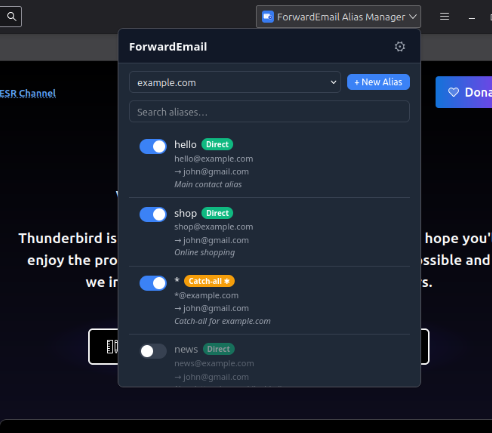
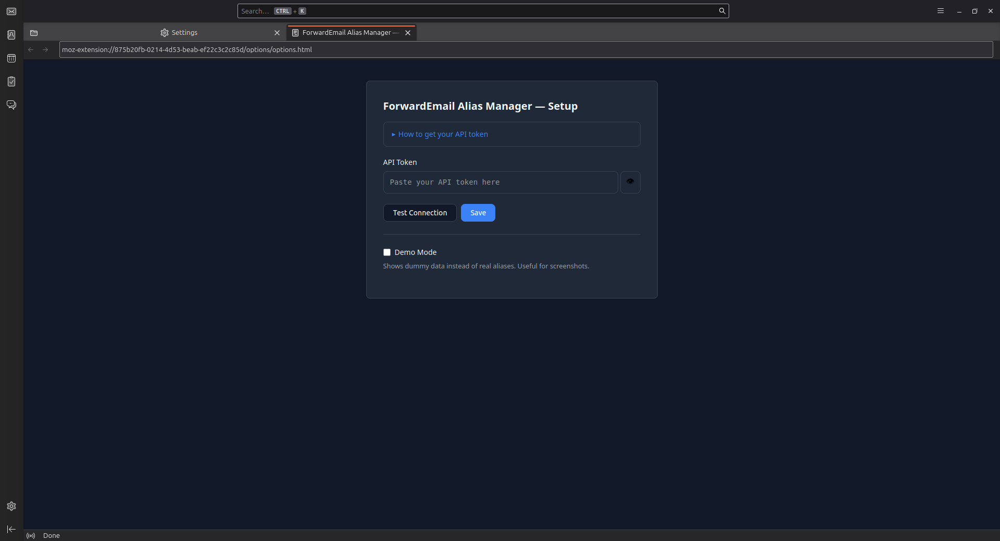

# ForwardMail Buddy — Thunderbird Extension

Manage your [ForwardEmail](https://forwardemail.net) aliases directly from Thunderbird.

## Features

- View and search all aliases across your domains
- Create, edit, and delete aliases
- Quick enable/disable toggle per alias
- Type badges: Direct, Catch-all, Regex
- Generate IMAP/SMTP passwords
- Dark mode support
- English and German localization

## Screenshots

| Alias Management | Settings |
|:---:|:---:|
|  |  |

## Requirements

- Thunderbird **128+** (Manifest V3 MailExtension)
- A ForwardEmail account with an API token

## Getting an API Token

1. Log in to [forwardemail.net](https://forwardemail.net)
2. Go to **My Account** > **Security** ([direct link](https://forwardemail.net/my-account/security))
3. Scroll to **API Tokens**
4. Click **Generate** to create a new token
5. Copy the token — you'll paste it into the extension settings

## Installation

### Temporary Add-on (Development)

1. Build the extension:
   ```bash
   bun run build
   ```
2. Open Thunderbird
3. Go to **Tools** > **Developer Tools** > **Debug Add-ons** (or navigate to `about:debugging`)
4. Click **Load Temporary Add-on...**
5. Select `dist/manifest.json`
6. The extension icon appears in the toolbar

> **Note**: If Thunderbird is installed via Flatpak, run `bun run package` and load `forwardemail.xpi` instead, because the Flatpak sandbox only grants access to the single file selected through the file picker.

### Permanent Installation (when published)

Install from Thunderbird Add-ons (ATN) — not yet published.

## Setup

1. Click the gear icon in the popup (or go to the extension's options page)
2. Paste your API token
3. Click **Test Connection** to verify
4. Click **Save**

## Usage

- Click the toolbar icon to open the popup
- Select a domain from the dropdown
- Browse, search, and manage your aliases
- Click an alias to view/edit details
- Use the toggle to quickly enable/disable aliases
- Click **+ New Alias** to create one

## Project Structure

```
├── manifest.json          # Source manifest copied into dist/
├── dist/                  # Compiled extension output (generated)
├── background/
│   └── background.ts      # Message handler, API + cache orchestration
├── popup/
│   ├── popup.html         # Main toolbar popup
│   ├── popup.ts           # Popup logic (list, detail, create views)
│   └── popup.css          # Popup styles with dark mode
├── options/
│   ├── options.html       # Settings / login page
│   ├── options.ts         # Settings logic
│   └── options.css        # Settings styles with dark mode
├── lib/
│   ├── api.ts             # ForwardEmail REST API client
│   ├── cache.ts           # TTL cache (domains: 5min, aliases: 2min)
│   └── utils.ts           # Alias type detection, formatting helpers
├── icons/                 # Extension icons (16/32/48/64/128px + source SVG)
└── _locales/
    ├── en/messages.json   # English strings
    └── de/messages.json   # German strings
```

## Building

```bash
bun install              # Install dependencies
bun run build            # Compile TypeScript into dist/
bun run build:watch      # Watch mode
bun run lint             # Lint source files
bun run test             # Run tests (compiles into .test-dist/)
bun run package          # Build + create forwardemail.xpi
bun run package:source   # Create source zip for ATN review
```

TypeScript is compiled into `dist/` via `tsc`. Static files (HTML, CSS, icons, locales) are synced by `scripts/sync-static.mjs`. The XPI is built from `dist/` only — no source files or dev artifacts are included.

## Privacy

See [PRIVACY.md](PRIVACY.md) for the full privacy policy.

## License

[MIT](LICENSE)
